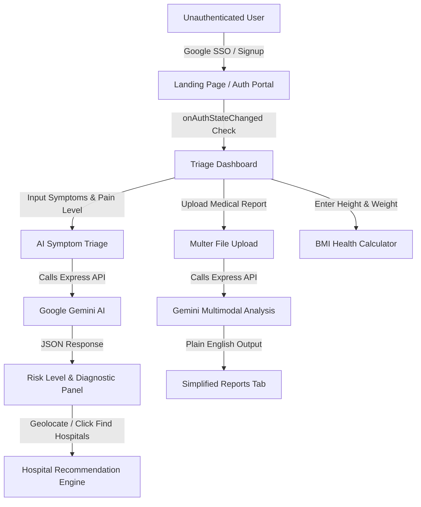

# MediAssist AI - System Documentation & Architecture Specification
**Project Version:** 1.0.0  
**Author:** Antigravity AI Coding Assistant  
**Date:** May 21, 2026  

---

## 1. Executive Summary

**MediAssist AI** is a next-generation, full-stack medical triage assistant and healthcare navigation application. The system leverages state-of-the-art Artificial Intelligence (Google Gemini 2.5 Flash) to provide patients with immediate, preliminary clinical evaluations, medical report simplifications, and hospital recommendations. 

Designed with a premium glassmorphic interface and fluid 3D parallax scroll animations, the application offers an engaging, accessible, and user-friendly experience to reduce the friction of seeking initial medical advice.

> [!WARNING]
> **Disclaimer:** MediAssist AI is an artificial intelligence triage helper meant for informational purposes. It is NOT a replacement for professional medical diagnosis, treatment, or advice. In case of a medical emergency, users must immediately contact local emergency services.

---

## 2. Directory Structure & Project Workspace

The workspace contains files from a previous movie review application (`RateMyFlick`) alongside the active medical application. Below is the structure, highlighting the active and legacy components:

```
Source_Code/
├── medical-dashboard/      <-- ACTIVE Frontend (React, Vite, Tailwind CSS, Framer Motion)
│   ├── src/
│   │   ├── components/
│   │   │   ├── LandingPage.jsx   <-- 3D Pseudo-Parallax Entry Portal
│   │   │   └── Chatbot.jsx       <-- Symptom-detecting Overlay Chat
│   │   ├── App.jsx               <-- Main Dashboard (Analysis, Reports, BMI)
│   │   ├── MedicalApp.jsx        <-- Core layout container
│   │   ├── firebase.config.js    <-- Firebase authentication setup
│   │   └── index.css             <-- Base styles and glassmorphism definitions
│   └── package.json
│
├── medical-backend/        <-- ACTIVE Backend (Node.js, Express, SQLite3, Google Gemini SDK)
│   ├── server.js                 <-- Main Express API Server and AI integration
│   ├── seed.js                   <-- Database seeding script for medical data
│   ├── medical_data.db           <-- SQLite3 Database
│   ├── uploads/                  <-- Temporary upload folder for medical report files
│   └── package.json
│
├── client/                 <-- LEGACY (Movie System Client - Inactive)
├── server/                 <-- LEGACY (Movie System Server - Inactive)
├── README.md               <-- LEGACY (Movie System Readme - Inactive)
├── SRS.md                  <-- LEGACY (Movie System SRS - Inactive)
└── start_app.bat           <-- LEGACY (Starts legacy movie system - Do not use for MediAssist)
```

---

## 3. Technology Stack & Key Libraries

### Frontend
- **React.js & Vite:** Fast hot-reloading development server and optimized bundle generation.
- **Tailwind CSS:** Modern utility-first styling used to define the dark-mode dashboard and UI layout.
- **Framer Motion:** High-performance animation library powering 3D card tilt effects, pseudo-parallax page scrolling, and smooth content transitions.
- **Lucide React:** Sleek, consistent iconography.
- **Firebase Authentication:** Handles secure user registration, Google Sign-In (Single Sign-On), and session state persistence via `onAuthStateChanged`.

### Backend
- **Node.js & Express:** Lightweight, scalable server environment exposing RESTful API endpoints.
- **Google Generative AI SDK (`@google/generative-ai`):** Communicates with the `gemini-2.5-flash` model for intelligent text parsing, structure generation, and image analysis.
- **Multer:** Handles multipart form-data requests for uploading patient reports (PDFs/images).
- **SQLite3:** Local database management for storing diagnostic templates and hospital references.
- **CORS:** Handles cross-origin communication between the client (port 5173) and the server (port 3000).

---

## 4. Key Workflows & Features



### 4.1. 3D Parallax Landing Page & Authentication
- **Visuals:** Uses HSL-based dark mode colors (`#0B0C10` background, electric blue accents, and deep glassmorphic containers). Employs multiple background glow spheres with blur filters to create depth.
- **Animations:** A 3D pseudo-parallax scroll effect dynamically shifts the header title, rotates the landing container, and fades content using smooth spring animations. Features a custom `TiltCard` component that tilts 3D-style on cursor hover.
- **Authentication:** Features a toggleable Sign-In/Sign-Up form. Uses Firebase's `signInWithPopup` with a Google Provider to authenticate users. An authentication listener (`onAuthStateChanged`) is registered in `App.jsx`, allowing returning users to automatically bypass the login screen and land directly in the dashboard.

### 4.2. Medical Triage & Analysis
- **Symptom Tracker:** Allows patients to enter demographics (Age, Gender) and append multiple tagged symptoms to a dynamic tag list. An interactive range slider rates pain severity on a scale from 1 to 10.
- **AI Processing:** Submits the compiled demographics, pain score, and symptom tags to the backend. The backend constructs a prompt instructing Gemini to evaluate risk levels, map conditions, write a clinic-quality analysis summary, compile foods to eat/avoid, and suggest a care specialist.
- **UI Diagnostics:** Renders a large dynamic banner matching the risk level (Red for High, Orange-Red for Moderate, Emerald for Low). Displays animated progress bars representing the percentage likelihood of probable conditions.

### 4.3. Hospital Locator & Geolocation
- **Location Processing:** Under the "Specialist" advice panel, clicking "Find Nearby Hospitals" requests the browser's HTML5 Geolocation coordinates (Latitude/Longitude). If access is blocked, it defaults to Hyderabad, India.
- **Recommendation:** Passes the coordinates and probable conditions to the backend. Gemini processes these inputs and recommends three physical hospitals in Hyderabad matching the conditions.
- **Google Maps Integration:** The dashboard displays the hospital name, specialty, relative distance, and includes a direct link to Google Maps generated via a custom query string (`mapsQuery`).

### 4.4. Medical Report Simplification
- **Document Scanning:** Users can upload scanned reports or documents directly from the sidebar.
- **Multimodal AI Evaluation:** The Express backend receives the file buffer via Multer, encodes it into a base64 string, and forwards it to Gemini alongside a medical simplification prompt.
- **Output:** Translates dense, confusing medical jargon into simple, reassuring, and actionable plain English, displaying the output in a clean, scrollable "Reports" tab.

### 4.5. Body Mass Index (BMI) Calculator
- **Calculation:** Takes height (cm) and weight (kg) values and calculates BMI:
  $$\text{BMI} = \frac{\text{Weight (kg)}}{\left(\text{Height (m)}\right)^2}$$
- **Diagnostics:** Categorizes the result into *Underweight* (blue), *Normal* (emerald), *Overweight* (yellow), or *Obese* (red), and outputs custom healthy living guidelines.
- **Reference Scale:** Integrates a graphical progress track representing the standard healthy BMI categories.

---

## 5. API Reference (Backend)

The backend server runs on `http://localhost:3000` and exposes three primary endpoints:

### 5.1. `POST /api/analyze`
Processes patient metrics and returns structured triage data.
- **Payload:**
  ```json
  {
    "symptoms": ["fever", "cough", "fatigue"],
    "age": "28",
    "gender": "Female",
    "painLevel": 4
  }
  ```
- **Response Schema:**
  ```json
  {
    "riskLevel": "MODERATE",
    "alert": "Clinical Evaluation Recommended",
    "analysis": "Clinical analysis text...",
    "emergencyAdvice": "Short instruction on emergency care...",
    "probableConditions": [
      { "name": "Viral Infection", "percentage": 78, "color": "orange" }
    ],
    "dietaryAdvice": {
      "foodsToEat": ["Bone broth", "Ginger tea"],
      "foodsToAvoid": ["Caffeine", "Spicy foods"]
    },
    "specialist": { "role": "General Physician" }
  }
  ```

### 5.2. `POST /api/analyze-report`
Simplifies medical uploads. Accepts multipart form data.
- **Request:** Form field name `report` holding a PDF or image file.
- **Response Schema:**
  ```json
  {
    "analysis": "Plain English report explanation..."
  }
  ```

### 5.3. `POST /api/find-hospitals`
Identifies local clinics based on location and suspected conditions.
- **Payload:**
  ```json
  {
    "latitude": 17.3850,
    "longitude": 78.4867,
    "conditions": [
      { "name": "Viral Infection", "percentage": 78 }
    ]
  }
  ```
- **Response Schema:**
  ```json
  [
    {
      "name": "Apollo Hospitals, Jubilee Hills",
      "address": "Road No 72, Jubilee Hills, Hyderabad",
      "specialty": "Cardiology and Specialty Care",
      "distanceStr": "4.2 km",
      "mapsQuery": "Apollo Hospitals Jubilee Hills Hyderabad"
    }
  ]
  ```

---

## 6. Execution & Troubleshooting Guide

### 6.1. Running the System Locally
Ensure you start the services in their correct folders. Do NOT use `start_app.bat` since it targets the legacy movie application.

#### 1. Start the Backend Server:
```bash
cd medical-backend
npm install
node server.js
```
*Note: Node runs the backend on port 3000.*

#### 2. Start the Frontend Dashboard:
On Windows PowerShell, npm script executions might occasionally trigger restriction policies. Ensure you run Vite via command line:
```bash
cd medical-dashboard
npm install
cmd /c "npm run dev"
```
*Note: Vite will launch the React dashboard on port 5173.*

### 6.2. Common Troubleshooting Steps

#### "localhost Refused to Connect" / `ERR_CONNECTION_REFUSED`
This indicates the backend or frontend service has stopped or crashed.
1. Check the terminal outputs to confirm both nodes are active.
2. Confirm no other processes are occupying ports 3000 and 5173.
3. Restart the servers manually.

#### AI Processing Failures (Fallback Trigger)
If the Google Gemini API key expires, encounters network issues, or faces throttling, the system uses robust fallback handlers:
- **Triage:** Reverts to a realistic moderate-risk viral assessment.
- **Report Analysis:** Displays general stable-vital feedback.
- **Hospitals:** Provides coordinates for Hyderabad's Apollo, KIMS, and CARE hospitals.

---
*End of Document. Generated with Antigravity AI.*
